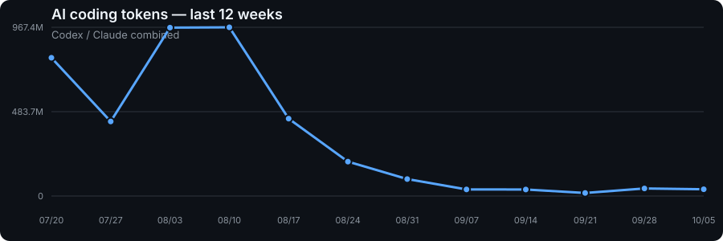

# Hi, I'm Bumgeun Park 👋
I'm a Ph.D. candidate at KAIST, developing learning algorithms for reliable decision-making in real-world environments.

My research focuses on data-efficient policy learning through approaches such as imitation learning and reinforcement learning, with a particular interest in robotics and autonomous driving.

<!-- AI_STATS:START -->
### 📊 AI tool use — all time

_Last updated: 2026-10-07 16:16 KST_

| Tool | Metric |
| --- | ---: |
| ChatGPT (web) | 154h 54m active time |
| AI coding (Codex / Claude) | 4417.6M tokens |

<!-- AI_STATS:END -->

**Bumgeun96/Bumgeun96** is a ✨ _special_ ✨ repository because its `README.md` (this file) appears on your GitHub profile.

Here are some ideas to get you started:

- 🔭 I’m currently working on ...
- 🌱 I’m currently learning ...
- 👯 I’m looking to collaborate on ...
- 🤔 I’m looking for help with ...
- 💬 Ask me about ...
- 📫 How to reach me: ...
- 😄 Pronouns: ...
- ⚡ Fun fact: ...
-->
